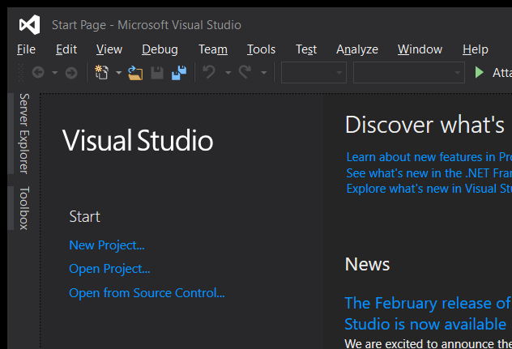
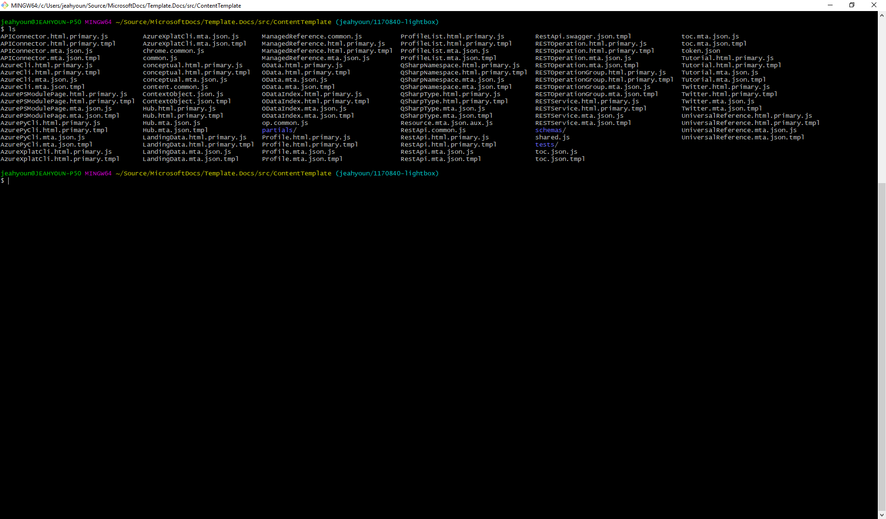
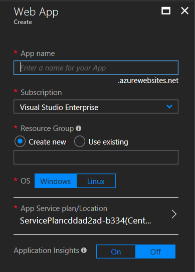

# Lightbox

General image link markup looks like this.

```markdown
[ ](https://static.pexels.com/photos/104827/cat-pet-animal-domestic-104827.jpeg)
```

...and renders as follows:

[ ](https://static.pexels.com/photos/104827/cat-pet-animal-domestic-104827.jpeg)

To enable the lightbox for a particular image, create an image link and add "#lightbox" to the end of the linked URL. An example is as follows:

```markdown
[ ](https://static.pexels.com/photos/104827/cat-pet-animal-domestic-104827.jpeg#lightbox)
```

This syntax will render as follows:

[ ](https://static.pexels.com/photos/104827/cat-pet-animal-domestic-104827.jpeg#lightbox)

Below is an example of how this might be used in practice.

## Quickstart: Use Visual Studio to create your first ASP.NET Core web app

In this 5-10 minute introduction to the Visual Studio integrated development environment (IDE), you'll create a simple C# ASP.NET Core web application. If you haven't already installed Visual Studio, install it for free [here](http://www.visualstudio.com).

[ ](../media/lightbox/vs-screenshot.png#lightbox)

## Quickstart: Use Azure Console Commands in Powershell or in Bash

In this 5-10 minute introduction to the Azure CLI, you'll learn to install the Azure CLI tools and use them in both Powershell and Bash (Ubuntu for Windows or Git Bash). Git Bash is included with Windows installations of Git.

[ ](../media/lightbox/consolescreenshot.png#lightbox)

## Quickstart: Create a new resource in the Azure Portal

During this introduction to the Azure Portal, you'll learn to create a new resource by following step-by-step examples. When you are finished, you'll have built a bot that leverages LUIS, Cognitive Services, and Azure Cosmos DB to improve business intelligence for Northwind Consulting Services.

[ ](../media/lightbox/azureportalscreenshot.png#lightbox)