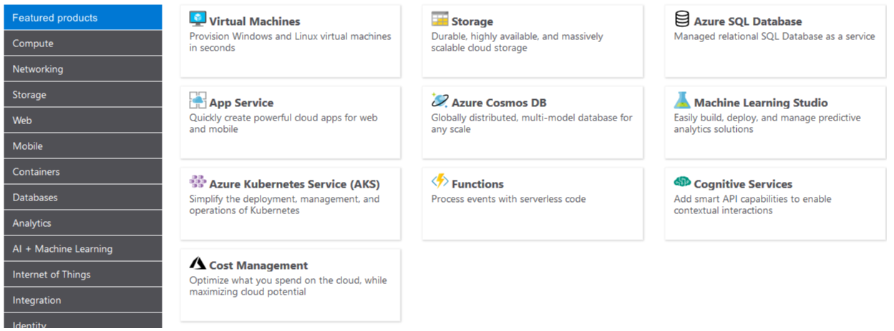

Products and services in Azure are arranged by category, which has various resources that you can provision. You select the Azure products and services that fit your requirements, and your account is billed according to Azure's pay-for-what-you-use model.

### Usage meters

When you provision an Azure resource, Azure creates one or more meter instances for that resource. The meters track the resources' usage, and generate a usage record that is used to calculate your bill.

For example, a single virtual machine that you provision in Azure might have the following meters tracking its usage:

:::row:::
  :::column:::
- Compute Hours
- IP Address Hours
- Data Transfer In
- Data Transfer Out
- Standard Managed Disk
  :::column-end:::
  :::column:::
- Standard Managed Disk Operations
- Standard IO-Disk
- Standard IO-Block Blob Read
- Standard IO-Block Blob Write
- Standard IO-Block Blob Delete
  :::column-end:::
:::row-end:::

The meters and pricing vary per product and often have different pricing tiers based on the size or capacity of the resource. Check the documentation for specific details on what each service area costs.

At the end of each monthly billing cycle, the usage values will be charged to your payment method and the meters are reset. You can check the billing page in the Azure portal at any time to get a quick summary of your current usage and see any invoices from past billing cycles.

The key takeaway is that resources are always charged _based on usage_. For example, if you de-allocate a VM then you will not be billed for compute hours, I/O reads or writes or the private IP address since the VM is not running and has no allocated compute resources. However you will incur storage costs for the disks.

> [!NOTE]
> De-allocating a VM is not the same as _deleting_ a VM. De-allocation means the VM is not assigned to a CPU or network in a datacenter. However, your persistent disks remain, and the resource is present in your subscription. It's similar to turning off your physical computer.
